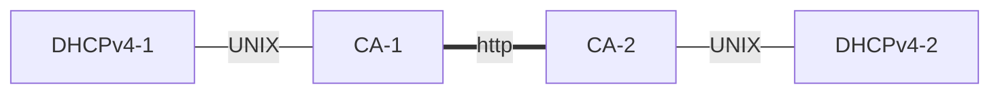

Kea Configuration Template: Home network of a power user
========================================================

This directory contains template configurations for home network of a power user. It may also be
appropriate for a small office. It makes the following assumptions:

- you want to use a single /24 class of IPv4 addresses
- you want High Availability, so there are 2 DHCP servers
- you have a handful of devices, and some of them (e.g. a printer or NAS) require
  static addresses or extra options
- you do not want to be bothered with database management
- the setup is optimized for minimal-to-zero maintenance
- performance is not an issue. You do not expect to see 100s of queries per second
- you do not use IPv6
- you do not want to update your DNS

The logical set-up consists of two hosts, each running Kea DHCPv4 server and a Control Agent (CA).
The server connects with the CA using UNIX sockets. Each DHCPv4+CA acts as one partner of the HA
pair.

The CA-1 and CA-2 will each open a TCP port 8000 and will connect to each other.

Deployment Considerations
-------------------------

The setup is not expected to be very performant. Most modest hardware will do. There are successful
deployments on Raspberry Pi platforms. If you are running a VM, 2GB ram with one CPU core should
be enough. If you don't have any preference, Ubuntu LTS is a choice that is easy to set up and is
low maintenance. However, any Linux or FreeBSD is fine. Less popular systems, such as OpenBSD or
NetBSD should also work in principle, but they are not regularly tested.

The assumption is that there are 2 hosts that will be running the Kea setup:
- 192.168.1.2 - primary HA server (active, will handle all the traffic)
- 192.168.1.3 - secondary HA server (passive, ready to take over in case the primary fails)

The network is 192.168.1.0/24. It is assumed that 192.168.1.1 is your default router.

The whole network is split into dynamic and static pools.
- 192.168.1.100 - 192.168.1.199 - this is the dynamic pool. When new devices appear in your network,
  they will be assigned dynamic addresses from this pool.
- The reservations are done outside of this dynamic range (depending on your addressing preference,
  either 192.168.1.1-192.168.1.99 or 192.168.1.200-192.168.1.254).

To deploy this setup, you need to conduct the following steps:
1. Install CA and DHCPv4 on host1, copy the config files to the typical locations. It's typically
   /etc/kea on Linux and /usr/local/etc/kea on FreeBSD. The files are typically called
   kea-ctrl-agent.conf and kea-dhcp4.conf. Please consult your start-up scripts.
2. At the very least alter the following to match your setup:
   - the interface name which Kea should listen on
   - the interface name which is used to access the subnet
   - your addressing, if you use something different than 192.168.1.0/24
   - tweak your router option
   - tweak your DNS option
3. If using firewall, make sure the server1 can reach the server2. A nice way to ensure that is to
   try to retrieve its config:

   curl -X POST -H "Content-Type: application/json" -d '{ "command": "config-get", "service": [ "dhcp4" ] }'  http://192.168.1.3:8000/

2. Install CA and DHCPv4 on host2

curl -1sLf   'https://dl.cloudsmith.io/public/isc/kea-1-9/setup.deb.sh'   | sudo -E bash

sudo apt install isc-kea-dhcp4-server isc-kea-ctrl-agent